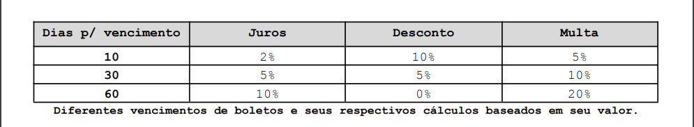
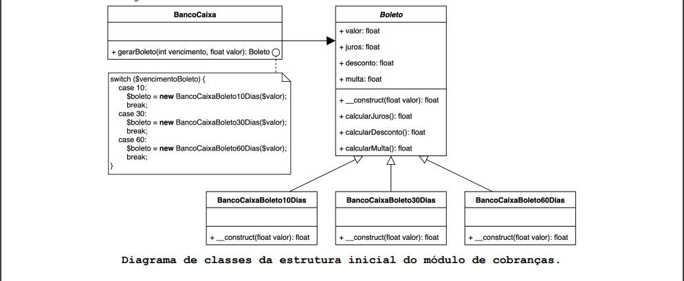
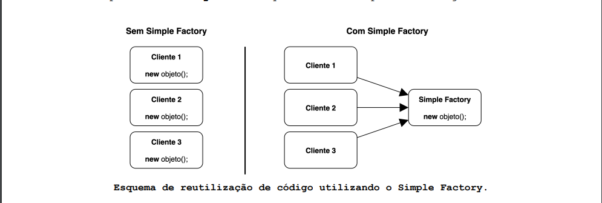
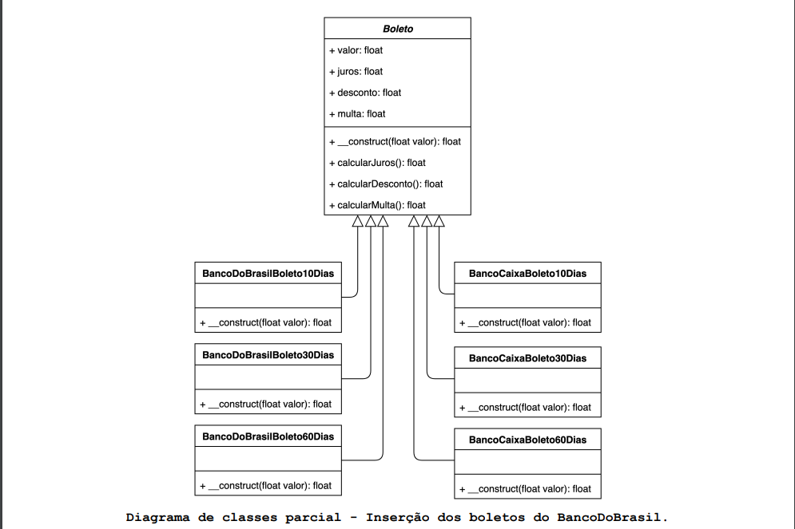
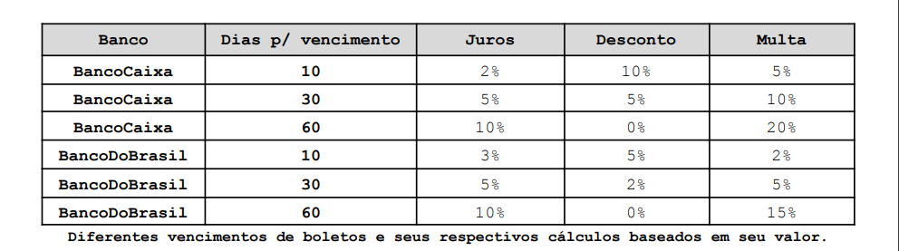
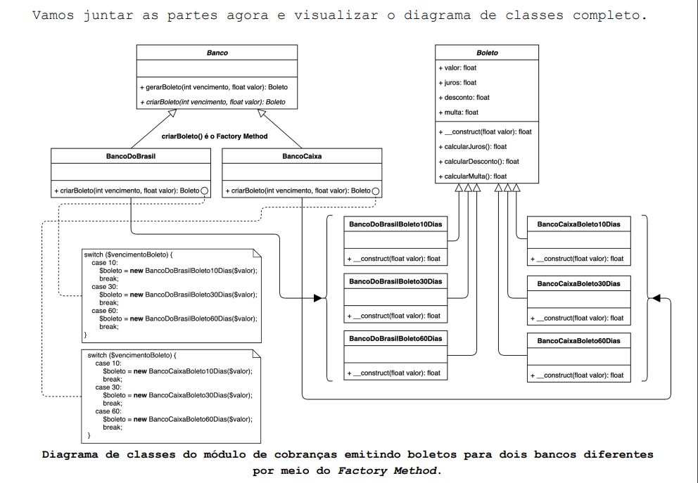
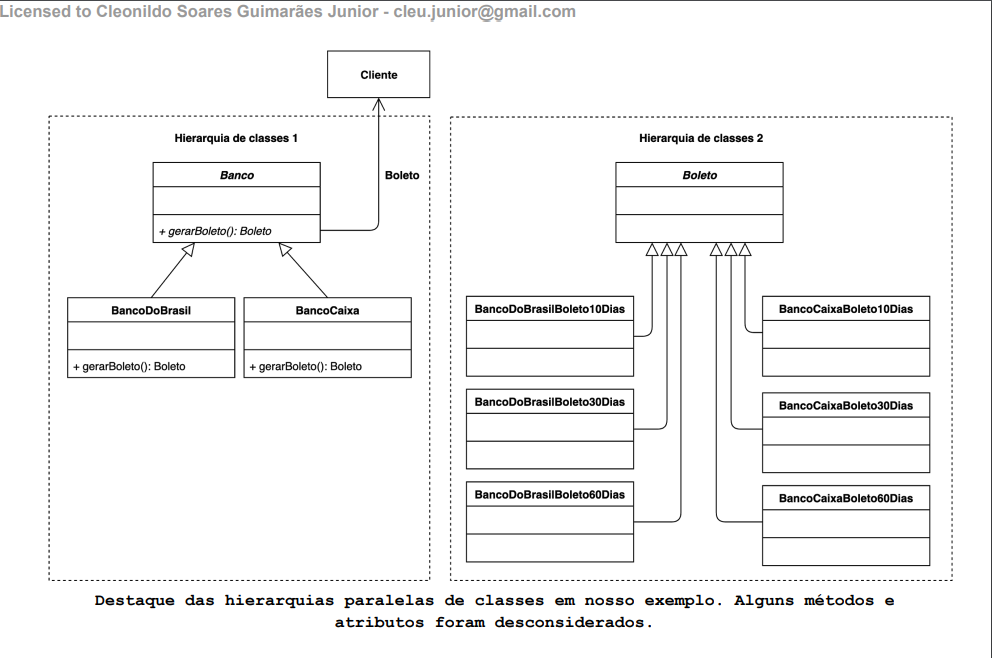
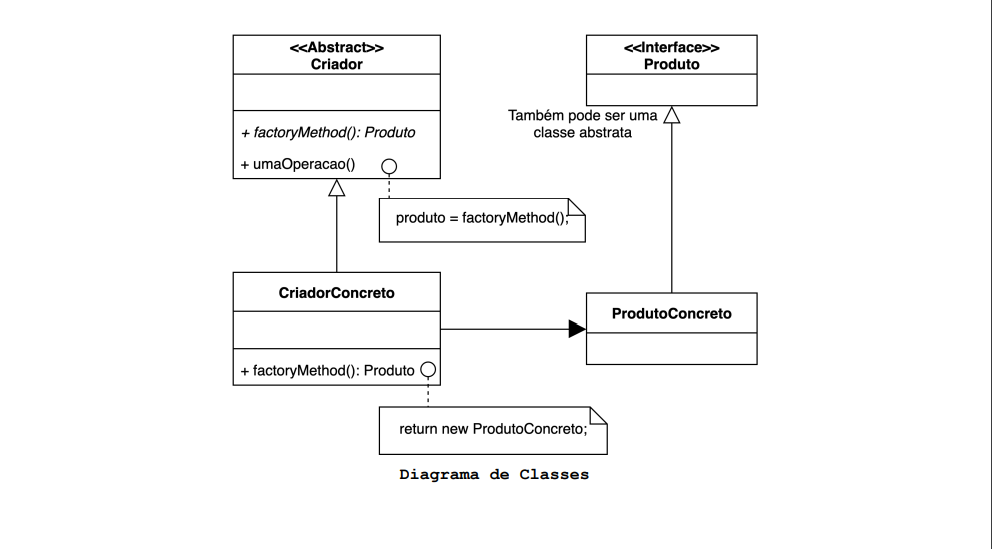

# O que é o padrão de design Factory Method?

O Padrão Factory Method define uma interface para criar um objeto, mas permite que a subclasses possam decidir qual
classe instanciar, possibilitando que uma classe seja capaz de prorrogar a instanciação de uma classe para subclasses.

## Motivação (Por que utilizar?)

Ao criar sistemas orientados a objetos não há como deixar de instanciar classes concretas, não existe nenhum problema
nisso, porém como e onde tais objetos são instanciados pode criar um forte acoplamento entre classes de um sistema.
Instanciar um objeto pode requerer processos complexos para que ele seja construído corretamente. Também pode causar uma
significativa duplicação de código em diferentes classes onde ele é utilizado.

Para facilitar o entendimento imagine um cenário onde temos um módulo de emissão de boletos em um software de cobranças.
Tal módulo emite boletos com 3 intervalos possíveis de vencimentos e diferentes juros, descontos e multas:

Atualmente o módulo de cobranças emite boletos de apenas um banco, no caso o **BancoCaixa**. O módulo se encontra
estruturado conforme o diagrama de classes a seguir:

A classe **BancoCaixa** é a responsável por instanciar objetos do tipo **Boleto10Dias**, **Boleto30Dias** ou
**Boleto60Dias** de acordo com o valor recebido no parâmetro **vencimento** do método **gerarBoleto()**.

Boleto é uma classe abstrata que contém os métodos responsáveis por calcular o Juros, Desconto e Multa do boleto. As
subclasses de boleto apenas definem as porcentagens em seu construtor.

O problema desta abordagem é o forte acoplamento entre a classe **BancoCaixa** e as classes de boleto. Para instanciar
os objetos concretos de boleto a classe **BancoCaixa** precisa conhecer as classes **Boleto10Dias**, **Boleto30Dias** e
**Boleto60Dias**.

Sempre que usamos a palavra reservada **new** estamos criando um objeto concreto, e por consequência estamos criando uma
dependência entre classes. É impossível criar um sistema orientado a objetos sem criar objeto, portanto a palavra
reservada **new** é fundamental, ela precisa ser usada, porém onde usá-la pode fazer toda diferença.

Vamos apenas mudar o local onde instanciamos os objetos. Ao invés de criá-los na classe **BancoCaixa** vamos criá-los na
classe **BoletoSimpleFactory**. Essa classe irá criar e retornar o boleto adequado, cabendo a classe **BancoCaixa**
somente solicitar o objeto para classe **BoletoSimpleFactory**.

Como é possível observar nas mudanças no diagrama de classes e no código, a criação dos objetos saiu da classe *
*BancoCaixa** e foi para o método **criarBoleto()** da classe **BoletoSimpleFactory**. Você pode estar se perguntando se
isso apenas não mudou o problema de lugar, de fato, no nosso caso sim. Porém agora a criação dos objetos estão
encapsuladas na classe **BoletoSimpleFactory**.

Caso os objetos criados pela classe **BoletoSimpleFactory** fossem utilizados em outros locais do software sua criação
estaria unificada e controlada pela classe **BoletoSimpleFactory** evitando duplicação de código. E ainda caso a criação
dos objetos fosse complexa os clientes não precisariam se preocupar com ela, bastaria pedir para a classe *
*BoletoSimpleFactory** criar e retornar o objeto pronto.

Essa estratégia onde se isola a criação de objetos em uma classe separada se chama **Simple Factory**, em português,
Fábrica Simples. Não se trata de um padrão de projeto, porém esse conceito irá nos ajudar a entender o padrão **Factory
Method** que veremos a partir de agora.

Suponha que surgiu a necessidade de emitir boletos de mais um banco. Agora além de **BancoCaixa** precisaremos emitir
boletos do **BancoDoBrasil**. Nós poderíamos criar outra Simple Factory para os boletos do **BancoDoBrasil**, o problema
desta abordagem é que não temos controle se todos os bancos são iguais, o **Cliente** não teria garantias que poderia
emitir boletos do **BancoDoBrasil** da mesma forma que emite em **BancoCaixa**.

Precisamos padronizar os bancos, garantir que eles possuam os mesmos métodos. Tanto o **BancoDoBrasil** quanto o banco
**BancoCaixa** geram boletos o possuem o método **gerarBoleto()** a única diferença entre eles são os boletos que devem
instanciar. Vamos criar uma classe abstrata **Banco** que possui o método **gerarBoleto()** e deixa a criação dos
boletos para as subclasses de **Banco** que serão **BancoCaixa** e **BancoDoBrasil**.

Voltando aos boletos, além dos boletos de **BancoCaixa** também teremos agora os boletos do **BancoDoBrasil**.

Nossa tabela de porcentagem fica assim:

Agora que já temos os boletos, podemos criar as subclasses de Banco.

Como é possível observar no diagrama de classes acima o método **criarBoleto()** da a classe **BancoDoBrasil** cria os
objetos:

● **BancoDoBrasilBoleto10Dias**;
● **BancoDoBrasilBoleto30Dias** ou
● **BancoDoBrasilBoleto60Dias**.

Já o método **criarBoleto()** da classe **BancoCaixa** cria os objetos:

● **BancoCaixaBoleto10Dias**;
● **BancoCaixaBoleto30Dias** ou
● **BancoCaixaBoleto60Dias**.

O método **gerarBoleto()** da classe **Banco** chama o método abstrato **criarBoleto()** da subclasse sem conhecê-la. Ou
seja, método **gerarBoleto()** pode chamar o método **criarBoleto()** da subclasse **BancoDoBrasil** ou **BancoCaixa**,
quem escolhe é o **Cliente** no momento em que ele instancia um objeto. Se o **Cliente** instanciar a subclasse
**BancoDoBrasil** consequentemente um boleto de 10, 30 ou 60 dias do **BancoDoBrasil** será criado pelo método
**criarBoleto()**. Da mesma forma, se o Cliente instanciar a subclasse BancoCaixa consequentemente um boleto de 10, 30
ou 60 dias do **BancoCaixa** será criado pelo método **criarBoleto()**.

É importante ressaltar que um Factory Method não precisa ser parametrizado. No nosso caso estamos escolhendo qual objeto
criar com base no parâmetro **vencimento**. É muito comum que o Factory Method não tenha parâmetros e instancie apenas
um objeto.

Repare em nosso teste (**Cliente**) que sempre estamos chamando o método **gerarBoleto()** independe se a variável
**banco** aponta para um objeto da classe **BancoCaixa** ou **BancoDoBrasil**. O que garante para o **Cliente** que o
método **gerarBoleto()** existe é o fato de que **BancoCaixa** e **BancoDoBrasil** são subclasses de **Banco**. O método
criarBoleto() que é abstrato na classe Banco sempre irá retornar uma instância de uma subclasse de **Boleto**. Temos
então duas hierarquias paralelas de classes no padrão Factory Method.

A **hierarquia de classes 2** da imagem acima (Boleto) possibilita que a **hierarquia de classes 1** (Banco) garanta
para **Cliente** que um boleto de qualquer um de seus bancos será criado a partir de um método padronizado, que é o
método fábrica (Factory Method), no caso de nosso exemplo é o método **criarBoleto()**. Deste modo temos duas
hierarquias de classes distintas que trabalham juntas para garantir a consistência de criação de boletos de acordo com o
banco escolhido pelo Cliente, ou seja, um banco da **hierarquia de classes 1** cria determinados boletos da **hierarquia
de classes 2**. Para expandir o módulo de cobranças para emitir boletos de 3 bancos distintos as duas hierarquias teriam
que ser expandidas.

## Aplicabilidade (Quando utilizar?)

- Quando uma classe não sabe antecipar qual tipo de objeto deve criar, ou seja, entre várias classes possíveis, não é
  possível prever qual delas deve ser utilizada.
- Quando se precisa que uma classe delegue para suas subclasses especificação dos objetos que instanciam.
- Quando classes delegam responsabilidade a uma dentre várias subclasses auxiliares, se deseja manter o conhecimento
  nelas e ainda saber qual subclasse foi utilizada em determinado contexto.

## Componentes

- **Produto**: Define a interface dos objetos que serão criados pelo método de factoryMethod() dos CriadoresConcretos.
- **ProdutoConcreto**: Implementa a interface Produto. Isso permite que classes que usam os Produtos possam esperar a
  interface Produto ao invés de um ProdutoConcreto.
- **Criador**: Declara o método fábrica (Factory Method) o qual retorna um objeto ProdutoConcreto. Também pode definir
  uma implementação padrão do factoryMethod, para o caso de uma subclasse o omitir. Tal implementação também precisa
  retornar um ProdutoConcreto. O Criador também é a classe que utiliza o ProdutoConcreto retornado pelo método
  factoryMethod.
- **CriadorConcreto**: Implementa ou sobrescreve o factoryMethod(), para retornar uma instância de um ProdutoConcreto.

## Consequências

- O padrão Factory Method elimina o forte acoplamento entre classes concretas. O código lida apenas com a interface do
  Produto, portanto, ele pode funcionar com qualquer classe ProdutoConcreto definida no sistema.
- Uma desvantagem potencial do Factory Method é que os clientes podem ter que subclassificar a classe Criador apenas
  para criar um objeto produtoConcreto específico. Subclassificar é bom quando o cliente precisa subclassificar a classe
  Creator de qualquer maneira, mas, caso contrário, o cliente agora deve lidar com outro problema.
- Criar objetos dentro de uma classe com um método factoryMethod() é sempre mais flexível do que criar um objeto
  diretamente. O padrão Factory Method fornece às subclasses um gancho (hook) para fornecer uma versão diferente de um
  objeto.
- No exemplo que consideramos até agora, o método fábrica **criarBoleto()** é chamado apenas pelos criadores concretos.
  Mas isso não precisa ser sempre assim. Os clientes podem achar os métodos de fábrica úteis, e os utilizar de forma
  direta, especialmente no caso de hierarquias de classes paralelas.
- Hierarquias de classe paralelas resultam quando uma classe delega algumas de suas responsabilidades a uma outra classe
  separada.
