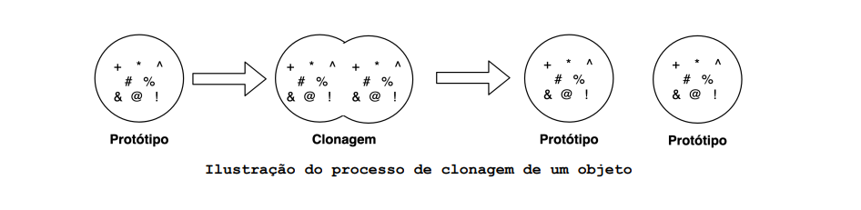
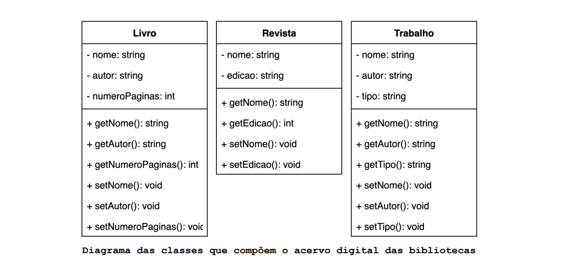
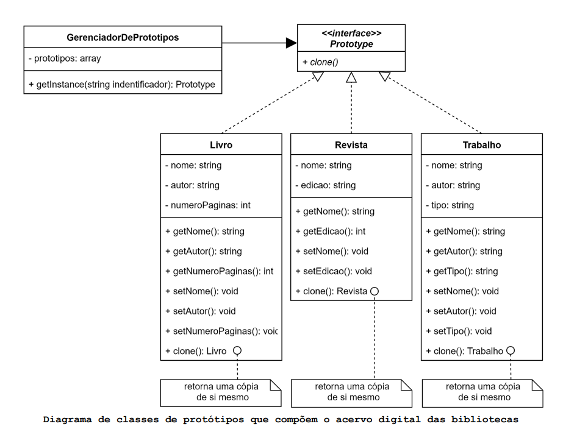
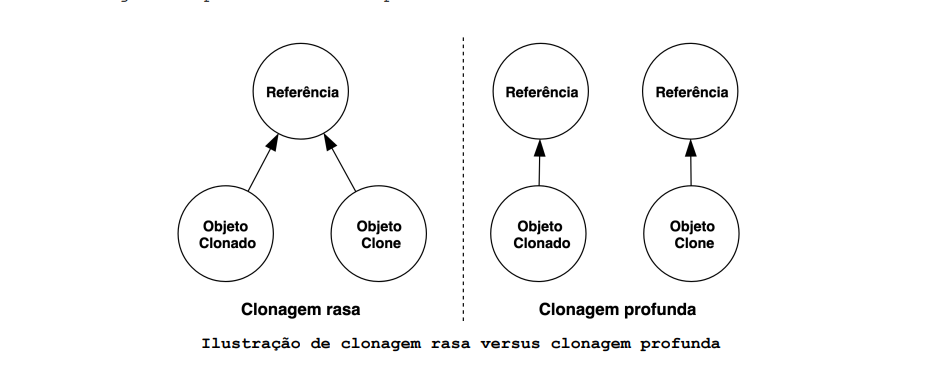
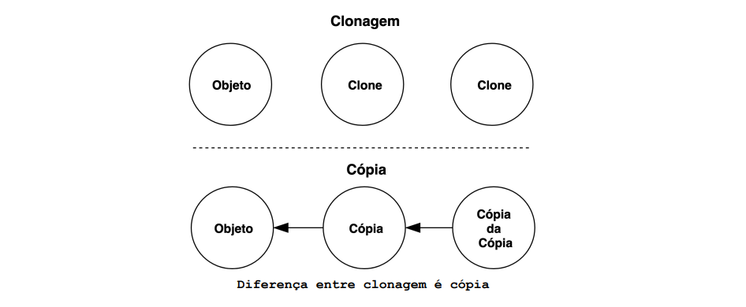
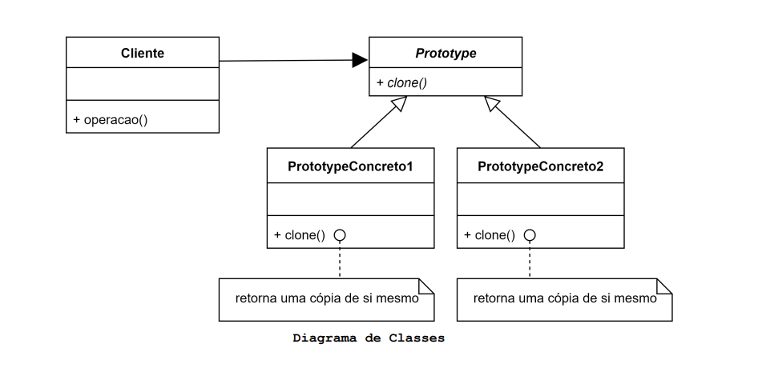

# O que é o padrão de design Prototype?

O padrão Prototype especifica tipos de objetos a serem criados usando como base uma instância de outro objeto que serve
como protótipo. Este padrão permite a clonagem de objetos existentes sem provocar dependência de suas classes.

## Motivação (Por que utilizar?)

Considere que está trabalhando com programação orientada a objetos e precisa criar um objeto idêntico a outro já
existente, para isso:

- Primeiro é necessário criar um objeto da mesma classe que o objeto a ser copiado.
- Depois copiar todos os atributos (variáveis de instância) do objeto existente para o novo objeto.

Nestes três passos podemos identificar três problemas:

- Alguns atributos do objeto a ser copiado podem ser inacessíveis de fora dele, por serem privados ou protegidos.
- Para copiar cada um dos atributos, o código responsável por fazer tal cópia precisa conhecer detalhes de implementação
  do objeto a ser copiado, isso causa dependência entre eles.
- Dependendo do contexto do código, pode-se conhecer apenas a interface do objeto a ser copiado, pois mais de um objeto
  de mesmo supertipo podem ser aceitos pelo contexto.

Para contornar tais problemas o padrão Prototype propõe que a responsabilidade de cópia do objeto passe a ser dele
mesmo, ou seja, o objeto se autocopia e retorna uma cópia pronta de si mesmo.

- Mesmo atributos privados ou protegidos são acessíveis dentro do próprio objeto.
- Como o objeto retorna uma cópia de si próprio, o código que solicita tal cópia não precisa conhecer os detalhes deste
  processo, precisa saber apenas que ele é capaz de se auto copiar.
- Apenas objetos concretos podem se auto copiar, então mesmo que seja representado por uma interface ele será capaz de
  retornar uma cópia de si próprio.

O termo mais adequado a esse processo de se auto copiar é **clonagem**, um objeto que suporta clonagem é chamado de
**protótipo**. O código solicitante de uma clonagem precisa saber que o objeto, para o qual a solicitação foi destinada,
é capaz de se clonar. Por este motivo ele precisa implementar uma interface que garanta tal funcionalidade. De forma
geral essa interface possui apenas um método **clonar()** que é muito parecido em todas as classes onde é implementado.
Ele basicamente cria um objeto de sua própria classe e carrega todos os atributos (variáveis de instância) do objeto
clonado para o objeto clone.

A clonagem pode ser muito útil quando existem diversos objetos com configurações complexas e diferentes. Ao invés de
gerenciar tais configurações no construtor da classe, pode-se criar um conjunto de objetos clonáveis, configurados de
diversas formas diferentes. Quando existir a necessidade de um objeto parecido com o um dos pré-configurados, basta
clonar um protótipo ao invés de construir um novo objeto do zero.

Quando o número de protótipos em um sistema não for fixo (ou seja, eles podem ser criados e destruídos dinamicamente), é
preciso manter um sistema de registro dos protótipos disponíveis. Os clientes não gerenciam os protótipos, mas os
recuperam e armazenam a partir do sistema de registro. Um cliente solicitará um protótipo ao sistema de registro antes
de cloná-lo. Tal sistema de registro é chamado de **gerenciador de protótipos**.

Vamos entender esse padrão por meio de um exemplo. Considere que estamos dando manutenção em um aplicativo que gerencia
o acervo de bibliotecas virtuais. Tais acervos são compostos por livros, revistas e trabalhos acadêmicos (Dissertações e
Teses) todos digitais. Nos foi dito que muitas instâncias de **Livros**, **Revistas** e **Trabalhos** são requisitadas
com muita frequência. Sabemos também que criar essas instâncias do zero é um processo muito trabalhoso (assumiremos isso
para viabilizar o exemplo), nosso desafio é facilitar a criação destes objetos.

Podemos utilizar o padrão Prototype já que instâncias de **Livros**, **Revistas** e **Trabalhos** são requisitadas com
muita frequência e sua criação é trabalhosa. Deste modo, criaremos as instâncias dos protótipos e sempre que precisarmos
de uma nova instância faremos a clonagem de um deles.

Para gerenciar os protótipos utilizaremos a classe **GerenciadorDePrototipos** seu papel é armazenar os objetos que
aceitam clonagem, ou seja, os protótipos. Cada protótipo terá um identificador que permite que o cliente solicite a
instância de um protótipo específico. O método **getInstance()** será o responsável por receber tal identificador e
retornar uma cópia do protótipo apropriado.

Em nosso exemplo temos um número fixo de protótipos. Caso a quantidade de protótipos fosse dinâmica, a classe *
*GerenciadorDePrototipos** precisaria de mais alguns métodos que permitissem adicionar e remover protótipos
dinamicamente a sua lista de protótipos disponíveis.

A parte mais difícil do padrão Prototype é implementar a operação **clone()** corretamente. É particularmente complicado
quando as estruturas de objetos contêm referências circulares. A maioria das linguagens fornecem suporte para clonagem
de objetos.

Existem duas maneiras de clonar objetos:

- **Clonagem rasa** (Shallow cloning): Clona o objeto, porém qualquer propriedade que seja referência a outra variável
  ou objeto, permanecerá como referência. Isso implica que assim que uma dessas referências mudar ambos os objetos,
  clonado e clone, serão afetados.
- **Clonagem profunda** (Deep cloning): Além de clonar o próprio objeto clona também os objetos referenciados por ele,
  ou seja uma nova árvore de objetos é criada de modo que, objeto clonado e clone sejam completamente independentes.

Vale ressaltar que **clonagem é diferente de cópia**. A clonagem resulta em dois objetos iguais porém independentes, o
grau de independência pode variar conforme o tipo de clonagem adotada. Já a cópia de um objeto apenas cria uma
referência a ele de modo que a edição de um objeto é propagada para todas as suas cópias.

## Aplicabilidade (Quando utilizar?)

O padrão Prototype pode ser utilizado quando um sistema deve ser independente de como seus produtos são criados,
compostos e representados. este padrão também pode ser utilizado:

- Quando as classes a serem instanciadas são especificadas em tempo de execução, por exemplo, por carregamento dinâmico.
- Para evitar a construção de uma hierarquia de classes de fábricas que seja paralela à hierarquia de classes de
  produtos.
- Quando instâncias de uma classe podem ter apenas algumas poucas combinações diferentes de estado. Pode ser mais
  conveniente criar um número correspondente de protótipos e cloná-los, em vez de instanciar as classes manualmente,
  cada vez com o estado apropriado.

## Componentes

- Prototype: Declara uma interface para clonar a si próprio.
- PrototypeConcreto: Implementa uma operação para clonar a si próprio.
- Cliente: Cria um novo objeto solicitando a um protótipo que clone a si próprio.

## Consequências

O padrão Prototype, assim como os padrões Abstract Factory e o Builder oculta as classes de produtos concretos do
cliente, reduzindo assim o número de classes que os clientes conhecem. Além disso, esses padrões permitem que um cliente
trabalhe com classes específicas de uma aplicação sem a necessidade de modificação.

O Prototype também:

- Faz com que novos tipos de protótipos possam ser registrados pelos clientes em tempo de execução, aumentando a
  quantidade de tipos de objetos que podem ser clonados.
- Permite que objetos sejam clonados sem acoplá-los a suas classes concretas.
- Possibilita que códigos de inicialização repetidos sejam substituídos por processos de clonagem de objetos protótipos
  pré-construídos.
- Torna a produção de objetos complexos mais simples.
- É uma alternativa à herança quando é preciso lidar com configurações pré determinadas para objetos complexos. Isso
  reduz o número de subclasses.
- A clonagem de objetos que possuem muitas referências a outros objetos ou referências circulares pode ser muito
  complexa.