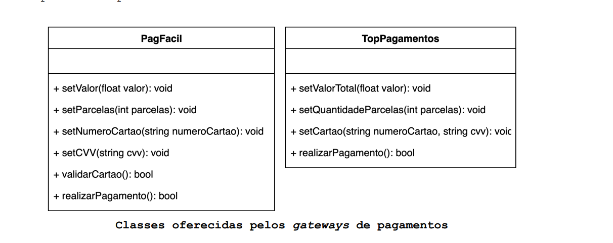
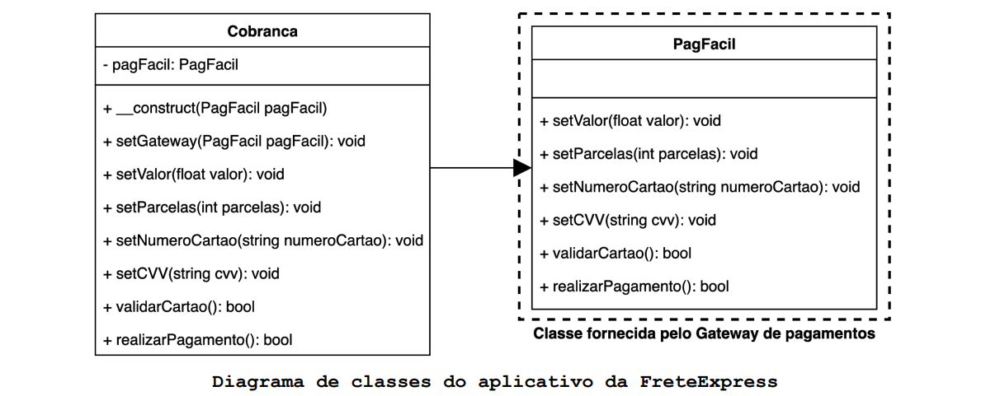
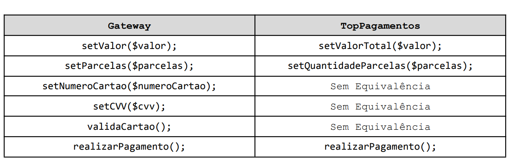
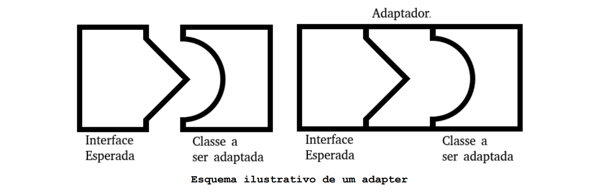
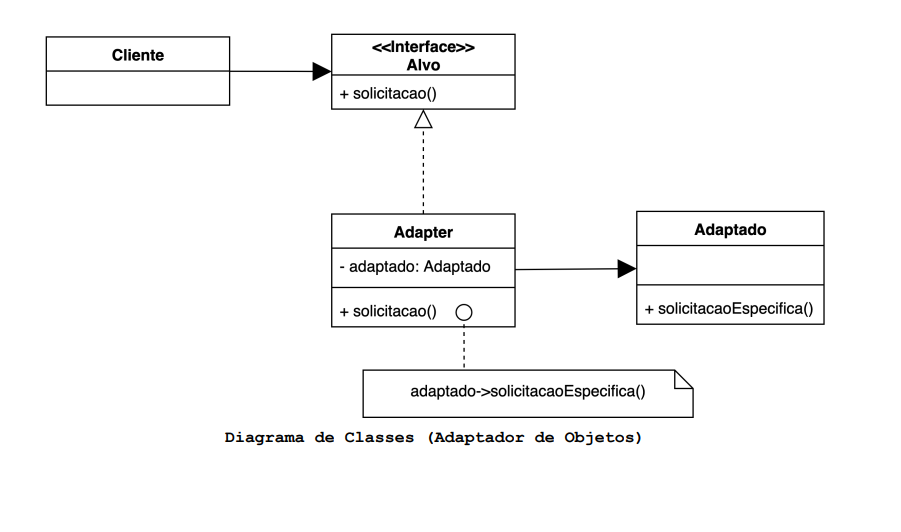
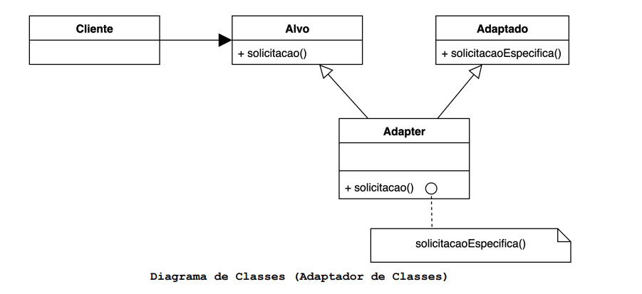

# O que é o padrão Adapter?

O padrão Adapter converte a interface de uma classe para outra interface que o cliente espera encontrar. O Adaptador
permite que classes com interfaces incompatíveis trabalhem juntas.

## Motivação (Por que utilizar?)

O Adapter serve para tornar compatíveis classes que antes não poderiam serem utilizadas em conjunto devido a suas
diferenças de interface. Este padrão é utilizado frequentemente em manutenções de códigos legados, muitas vezes novas
classes não são compatíveis com as existentes no código, de modo que um cliente não pode as utilizar de forma
transparente.

Para tornar essa explicação mais ilustrativa, suponha que trabalhamos na empresa **FreteExpress**, ela possui um serviço
de agendamento de fretes por um aplicativo, e faz a cobrança de seus clientes antecipadamente por um gateway de
pagamentos.

Os serviços da **PagFácil** têm sido utilizados desde a fundação da FreteExpress, porém surgiu um novo fornecedor no
mercado, a **TopPagamentos**. Ele cobra uma taxa fixa maior que a PagFácil por cada pagamento, porém cobra juros menores
por parcelamentos no cartão de crédito.

A FreteExpress decidiu aderir os serviços da TopPagamentos em conjunto com a PagFácil:

- Para pagamentos à vista deverá ser utilizado o serviço da PagFácil, já que a taxa fixa do pagamento é
  consideravelmente menor que a da TopPagamentos. Além disso, a taxa de 5% ao mês da PagFácil não será aplicada a
  pagamentos à vista.

- Já para pagamentos parcelados o serviço da TopPagamentos deverá ser utilizado. Ela cobra uma taxa fixa de R$5,00 mas
  esse valor se justifica em relação ao baixo juros ao mês (1%) que incide sobre as parcelas.

A documentação dos gateways de pagamento diz que as seguintes classes estão disponíveis para seus clientes.

Essas classes são fornecidas, então, elas não podem ser modificadas. Nosso código deve utilizá-las da forma que estão.

No momento o projeto que precisamos incrementar se encontra da seguinte forma:

A classe **Cobranca** é a responsável por solicitar a cobrança dos clientes por meio de um gateway de pagamentos. A
empresa. PagFácil foi o primeiro gateway a ser utilizado, portanto, o projeto da classe **Cobranca** foi baseado na
classe **PagFacil**.

No momento a classe **Cobranca** depende diretamente da classe **PagFacil** que é uma classe concreta fornecida por um
terceiro.
Neste cenário seria mais prudente que a classe **Cobranca** dependesse de uma abstração, como uma interface por exemplo.

Vamos criar uma interface para intermediar a relação entre a classe cobrança e as classes dos gateways de pagamentos.
Para minimizar os impactos causados pela refatoração, vamos manter a mesma nomenclatura dos métodos da classe
**PagFacil** nos métodos da interface.

Vejamos uma comparação de equivalência entre os métodos da interface **Gateway** e da classe **TopPagamentos**:

Repare que a classe **TopPagamentos** não possui métodos equivalentes aos métodos **setNumeroCartao()**, **setCVV()** e
**ValidaCartao()** da interface **Gateway**. Portanto a classe **TopPagamentos** também precisa de um adaptador. Mas
diferente da classe **PagFacil** que precisava apenas de uma conversão de interface, a classe **TopPagamentos** precisa
de um trabalho extra de adaptação de seus métodos para atender a interface **Gateway**.

Sabemos que a interface alvo é **Gateway** então o adaptador precisa implementar essa interface. Sabemos também que
vamos adaptar a classe TopPagamentos, deste modo devemos manter uma referência a ela.

A utilização das classes **PagFacil** de **TopPagamentos** ficou padronizada, a classe **Cobranca** utiliza as classes
**PagFacilAdapter** e **TopPagamentosAdapter** como classes intermediárias que permitem tal padronização. Como resultado
disso, a utilização da classe Cobranca é transparente para o cliente, ele não precisa se preocupar em utilizar métodos
diferentes de acordo com o Gateway de pagamento que está sendo utilizado por **Cobranca**.

## Aplicabilidade (Quando utilizar?)

- Quando existe a necessidade de utilizar uma classe existente e sua interface é diferente da esperada.
- Quando se deseja criar uma classe reutilizável que coopera com classes não relacionadas a ela ou que não foram
  previstas, ou seja, classes que não necessariamente têm interfaces compatíveis.
- (Somente para adaptadores de objeto) Quando é necessário usar várias subclasses existentes, mas é impraticável adaptar
  sua interface sub-classificando cada uma delas. Um adaptador de objeto pode adaptara interface de sua superclasse.

## Componentes

- **Cliente**: É a classe que espera a interface alvo.
- **Alvo**: Interface esperada pelo Cliente. Deve ser implementada pelo Adapter.
- **Adapter**: Converte a interface de Adaptado para a interface Alvo. Delega todas as solicitações para Adaptado.
- **Adaptado**: Classe que possui interface incompatível com o cliente e por isso precisa ser adaptada.

## Consequências

- A quantidade de trabalho que o Adapter faz depende de quão semelhante a interface do Alvo é do Adaptado. Há uma
  variação no volume de trabalhos que executar para adaptar um classe para a interface alvo, vai desde a simples
  conversão de interface, por exemplo, alterando os nomes das solicitações, até o suporte a um conjunto de solicitações
  totalmente diferente.
- Uma classe é mais reutilizável quanto menor for a quantidade de suposições que outras classes devem fazer para usá-la,
  o Adapter elimina tais suposições. Em outras palavras, um adaptador de interface permite incorporar uma classe em
  sistemas existentes que podem esperar interfaces diferentes para a classe.
- Um problema em potencial com adaptadores é que eles não são transparentes para todos os clientes. Um objeto adaptado
  não oferece a interface do objeto original, portanto, ele não pode ser usado onde o objeto original é esperado.
  Adaptadores bidirecionais podem fornecer essa transparência. Especificamente, são úteis quando dois clientes
  diferentes precisam exibir um objeto de maneira diferente. Para criar um adaptador bidirecional que atua
  simultaneamente como uma interface antiga e uma interface nova, basta que ele implemente ambas as interfaces
  envolvidas. Em alguns cenários é preciso utilizar herança múltipla.
- Até agora falamos apenas sobre **adaptadores de objeto**, inclusive o diagrama de classe da sessão “Componentes”
  representa um adaptador desse tipo. Entretanto existe outro tipo, que são os **adaptadores de classes**, cuja
  implementação requer herança múltipla e este recurso não está disponível no PHP até sua versão atual (7.4). Neste
  caso, ao invés de usar a composição para adaptar o Adaptado, o Adaptador utiliza subclasses das classes adaptada e
  classe Alvo.

- Adaptadores de objetos e de classes causam diferentes consequências.
1. Um adaptador de Objetos (Por composição):

1.1 Permite que um único adaptador funcione com muitos adaptados, ou seja, o próprio adaptado e todas as suas subclasses 
(se houver). O adaptador também pode adicionarfuncionalidade a todos os adaptados de uma só vez.

1.2 Dificulta sobrescrever (override) o comportamento de Adaptado. Isso exigirá uma sub-classificação de Adaptado e fará 
com que o Adaptador se refira à subclasse em vez do próprio Adaptado.

2. Um adaptador de Classes (Por herança):

2.1 Adapta a classe Adaptado ao Alvo comprometendo-se com uma classe concreta Adapter. Como consequência, um adaptador de 
classe não funcionará quando queremos adaptar uma classe e todas as suas subclasses.

2.2 Permite que o Adapter substitua parte do comportamento do Adaptado, pois o Adapter é uma subclasse Adaptado.

2.3 Introduz apenas um objeto, e não é necessário nenhum direcionamento adicional do ponteiro (manter referência) para a 
classe Adaptado.
