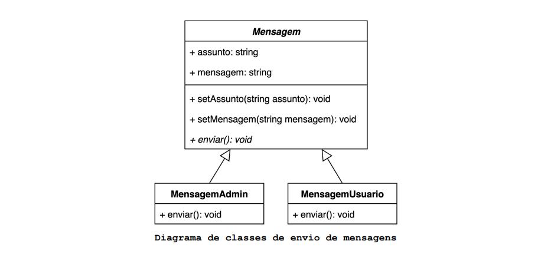
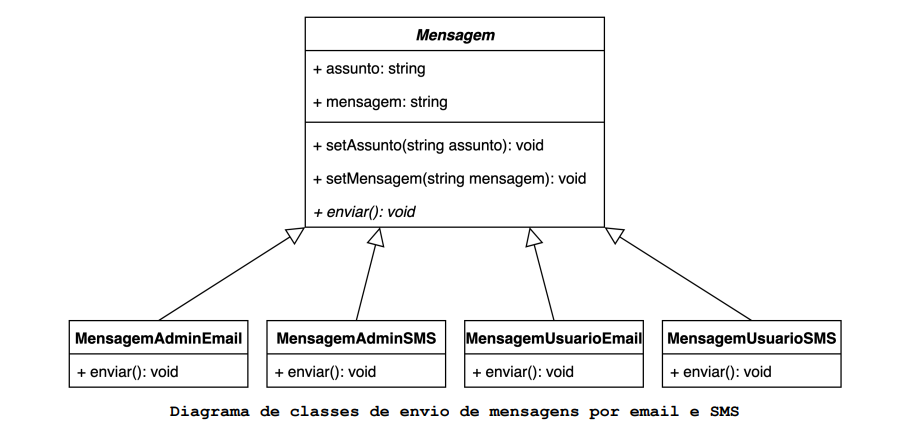
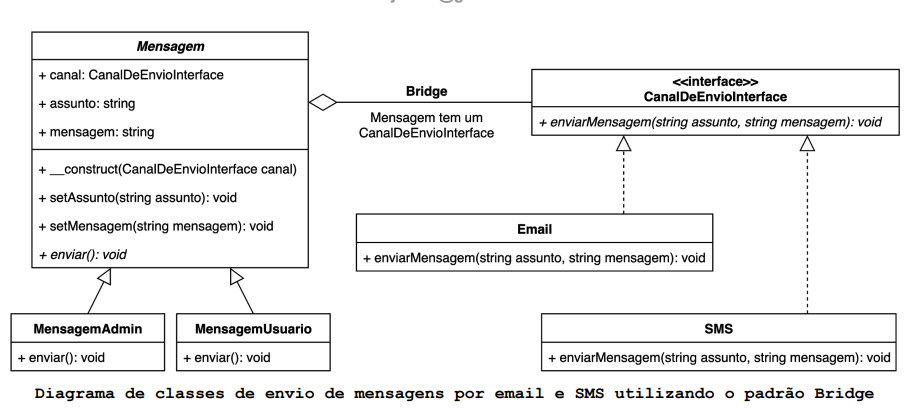
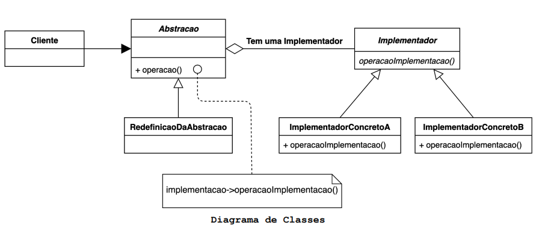

# O que é o padrão Bridge?

O Padrão Bridge desacopla uma abstração de sua implementação, ou seja, permite dividir uma classe grande ou um conjunto 
de classes diretamente ligadas em duas hierarquias separadas, deste modo as duas hierarquias podem variar de forma independente.

## Motivação (Por que utilizar?)

Quando uma abstração pode ter uma entre várias implementações possíveis, a maneira usual de implementar isso é usando 
herança. Uma classe abstrata define a interface para a abstração, e subclasses concretas que a implementam de maneiras 
diferentes, mas, essa abordagem nem sempre é flexível o suficiente. A herança vincula permanentemente uma implementação 
à abstração, o que torna difícil modificar, estender e reutilizar abstrações e implementações de forma independente.
Vamos analisar isso de forma mais visual, imagine um módulo de troca de mensagens entre administrador e usuários de um 
sistema, suponha que a mensagem enviada pelo administrador é diferente da enviada pelo usuário. Inicialmente precisamos 
apenas da mensagem e que tanto administrador quanto usuário sejam capazes de enviá-las.

Temos duas implementações possíveis para Mensagem, repare no diagrama, que apenas criando as subclasses temos uma solução 
satisfatória. **MensagemAdmin** envia mensagens do administrador para os usuários e **MensagemUsuario** envia mensagens 
dos usuários para o administrador.

Agora considere que a mensagem pode ser enviada por e-mail ou por SMS. Vejamos como ficaria nosso diagrama de classes 
seguindo a mesma abordagem de herança.

A quantidade de classes no diagrama dobrou, tal problema ocorre porque estamos tentando estender as classes de **Mensagem** 
em duas dimensões diferentes:

- Por tipo de usuário.
- Por canal de envio da mensagem.

Este é um problema muito comum com herança de classes. Imagine que a mensagem também precisa ser enviada por WhatsApp, 
seria necessário criar mais duas classes **MensagemAdminWhats** e **MensagemUsuarioWhats**. A cada novo canal de envio de mensagem 
ou novo tipo de usuário, a quantidade de subclasses iria crescer. 

Existe um princípio de OO que diz “Priorizar a composição 
ao invés da herança”. O padrão Bridge tenta resolver o problema de subclassificação seguindo este princípio. Isso significa 
que uma das dimensões deve ser extraída da hierarquia de **Mensagem** e criar uma hierarquia de classes separada. Deste modo, 
as classes originais irão referenciar um objeto da nova hierarquia, ao invés de ter todos os seus estados e comportamentos
dentro de uma única classe.

Vamos extrair o canal de envio da hierarquia de **Mensagem**. Assim ela será subclassificada apenas em termo de tipo de usuário 
e irá referenciar a hierarquia de canal de envío.

Agora existem hierarquias de classes separadas, uma para o tipo de usuário e outra para o canal de envio. Com a nova 
configuração a **Mensagem** pode delegar qualquer trabalho referente ao canal de envio para o objeto ligado a 
**CanalDeEnvioInterface**. Essa referência vai agir como uma ponte (em inglês bridge) entre as classes Mensagem e 
**CanalDeEnvioInterface**. De agora em diante, para adicionar novos canais de envio ou novos usuários não será necessário 
mudar a hierarquia de **Mensagem** e vice-versa.

## Aplicabilidade (Quando utilizar?)

- Quando se deseja evitar uma ligação permanente entre uma abstração e sua implementação. Pode ser o caso, por exemplo, 
quando a implementação deve ser selecionada ou alternada no tempo de execução.
- Quando tanto as abstrações quanto suas implementações devem ser extensíveis por subclassificação. Nesse caso, o padrão 
Bridge permite combinar as diferentes abstrações e implementações e estendê-las independentemente.
- Quando mudanças na implementação de uma abstração não devem causar impacto nos clientes (o cliente não pode ser recompilado).
- Quando existe uma proliferação de classes, como mostrado anteriormente no “Diagrama de classes de envio de mensagens 
por email e SMS”. Essa hierarquia de classes indica a necessidade de dividir um objeto em duas partes.
- Quando se deseja compartilhar uma implementação entre vários objetos, e esse fato deve estar oculto no cliente

## Componentes

- **Abstracao**: Define a interface da Abstração e mantém uma referência a um objeto do tipo Implementador.
- **RedefinicaoDaAbstracao**: Estende a interface definida por Abstracao. É opcional.
- **Implementador**: Define a interface para as classes de Implementador. Essa interface não precisa ser igual a interface 
Abstracao, na verdade, as duas interfaces podem ser bem diferentes. Normalmente, a interface do Implementador fornece 
apenas operações primitivas e a Abstracao define operações de nível superior com base nessas primitivas.
- **ImplementadorConcreto**: Implementa a interface do Implementador e define sua implementação concreta.

## Consequências

- Desacopla a interface da implementação. Uma implementação não ficavinculada permanentemente a uma interface. A 
implementação de uma abstração pode ser configurada em tempo de execução. É até possível para um objeto alterar sua 
implementação em tempo de execução.

O desacoplamento de **Abstracao** e **Implementador** também elimina dependências de tempo de compilação na implementação. 
Alterar uma classe de implementação não requer recompilação da classe **Abstracao** e seus clientes. Além disso, tal 
desacoplamento incentiva o uso de camadas que podem levar a um sistema melhor estruturado. A parte de alto nível de um 
sistema precisa apenas conhecer **Abstracao** e **Implementador**.

- Extensibilidade aprimorada. É possível estender as hierarquias de **Abstracao** e **Implementador** de forma independente.
- Ocultação de detalhes de implementação dos clientes. é possível proteger os clientes de detalhes de implementação, tais 
como o compartilhamento de objetos do **Implementador**.
