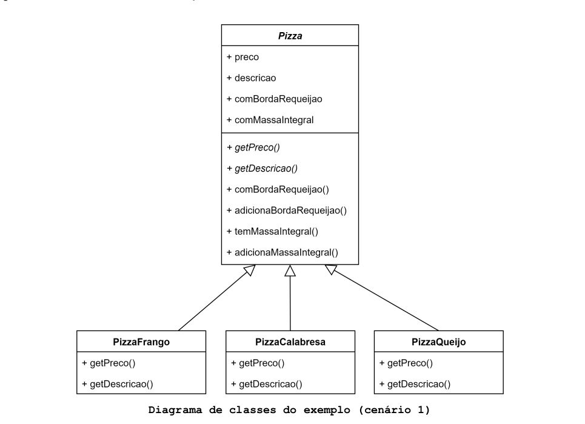
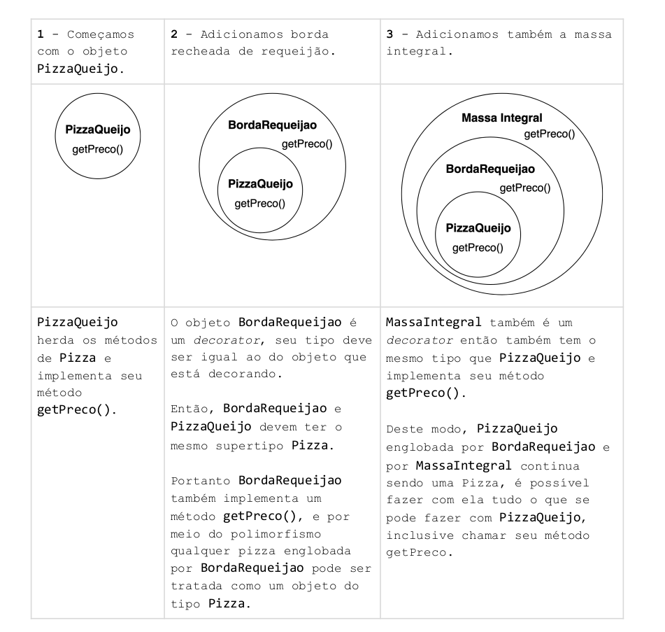
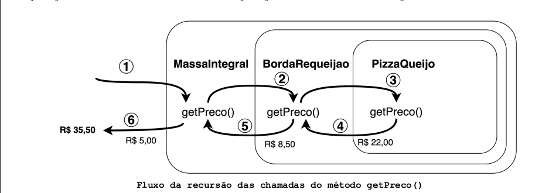
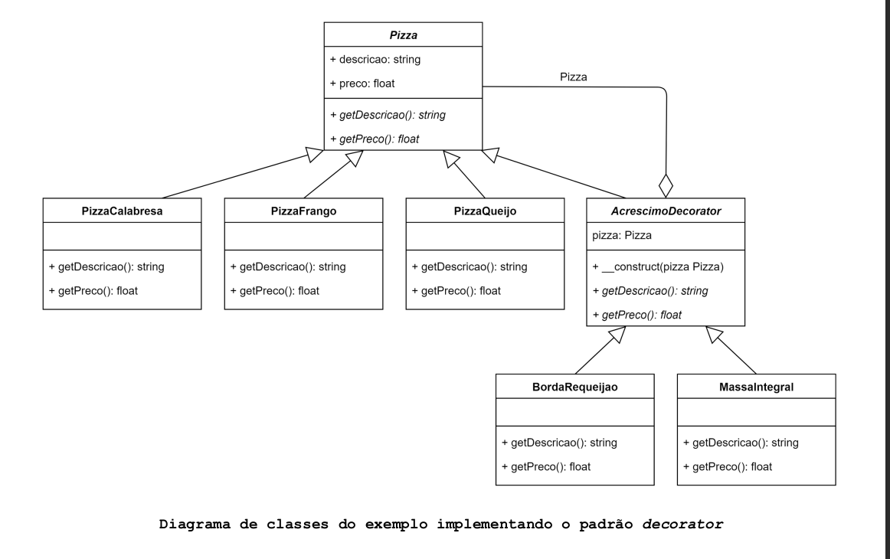
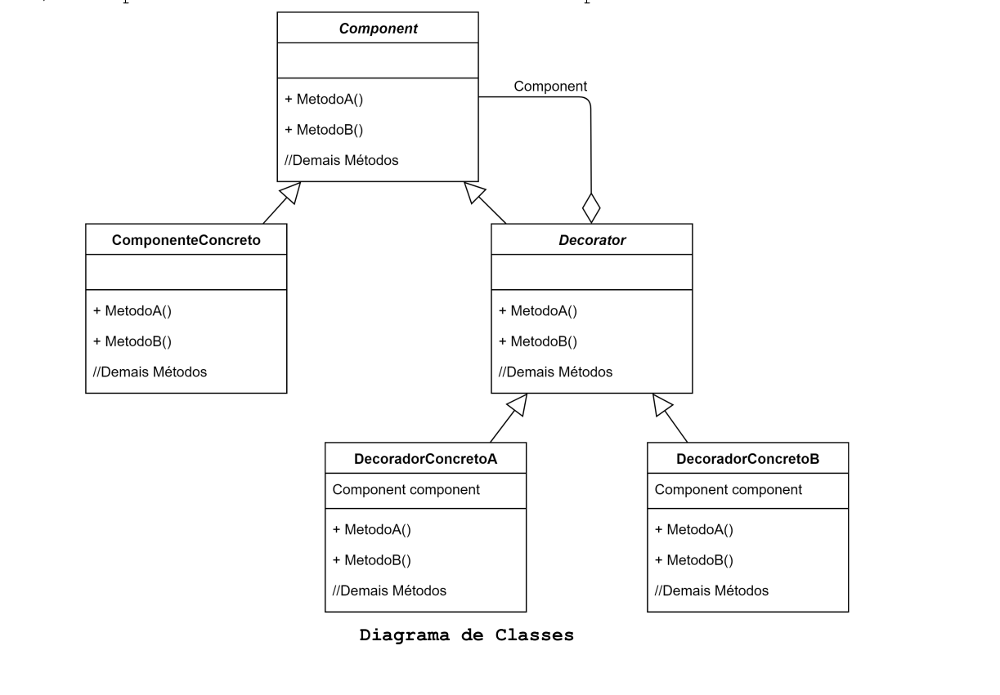

# O que é o padrão Decorator?

O Padrão Decorator anexa responsabilidades adicionais a um objeto dinamicamente. Os Decorators fornecem uma alternativa 
flexível ao uso de subclasses para extensão de funcionalidades.

## Motivação (Por que utilizar?)

Às vezes, queremos adicionar responsabilidades a objetos individuais, não a uma classe inteira. Uma maneira de adicionar 
responsabilidades é com herança. Herdar uma característica de outra classe faz com que a subclasse também a tenha. Isso 
é inflexível, pois, a definição de tal característica é feita estaticamente, de modo que Cliente não pode controlar como 
e quando decorar o objeto com ela.

Para ilustrar tal situação, tomemos como exemplo o sistema de uma Pizzaria, onde o cliente pode acrescentar 
características adicionais a sua pizza. É importante dizer que os donos da pizzaria em breve criarão novos sabores de 
pizza e novos acréscimos.

#### A pizzaria possui 3 sabores de pizza em seu cardápio:

- Pizza de Frango - R$19,00;
- Pizza de Calabresa - R$25,00;
- Pizza de Queijo - R$22,00;

#### Os acréscimos são:
- Borda recheada com requeijão - R$8,50;
- Massa Integral - R$5,00;

Cada pizza tem um preço, ao adicionar um acréscimo seu valor deve ser somado ao valor da pizza. Por exemplo, uma pizza 
de frango com borda recheada de requeijão custaria R$27,50.

**R$19,00 pela pizza + R$8,50 pela borda de requeijão = R$27,50**

Todas as pizzas devem possuir um preço e uma descrição. Seria inviável criar uma classe para cada combinação possível,
como PizzaCalabresaBordaRequeijao ou PizzaQueijoMassaIntragral. A cada novo tipo de pizza ou novo acréscimo o número de 
classes cresceria exponencialmente.

É possível utilizar herança.

####  A classe Pizza é uma classe abstrata que possui os atributos:
- **preco:** float - Preço da Pizza
- **descricao:** string - Descrição da pizza
- **comBordaRequeijao**: bool - Indica se a pizza tem borda recheada.
- **comMassaIntegral**: bool - Indica se a pizza tem massa integral.

E os seguintes métodos:

- **getPreco():** Método abstrato - todas as classes que herdam de Pizza deve o implementar - define o preço da pizza.
- **getDescricao():** Método abstrato - todas as classes que herdam de Pizza
- **deve o implementar** - define a descrição da pizza.
- **temBordaRecheada():** retorna o atributo comBordaRequeijao.
- **adicionaBordaRequeijao():** define comBordaRequeijao como true.
- **temMassaIntegral():** retorna o atributo comMassaIntegral.
- **adicionaMassaIntegral():** define comMassaIntegral como true.

Deste modo **PizzaFrango**, **PizzaCalabresa** e **PizzaQueijo** teriam que implementar seu próprio método getPreco() e
herdariam todos os demais métodos e atributos da classe abstrata Pizza.

O problema do uso de herança no caso das pizzas é a inflexibilidade que ela trás. Todos os acréscimos são atribuídos às 
subclasses em tempo de compilação. Imagine que a pizzaria começasse a servir pizzas doces, todas elas teriam o atributo 
**comBordaRequeijao**, o que não faz sentido. Neste caso seria ideal se fosse possível expandir as pizzas em tempo de execução, 
onde os acréscimos pudessem ser adicionados a elas conforme a necessidade surgisse. É aí que o padrão decorator pode 
entrar. suponha que queremos uma pizza de queijo com borda recheada de requeijão e massa integral. Vamos iniciar com uma 
pizza de queijo e decorá-la com os acréscimos.

Veja abaixo como aconteceria o cálculo do valor total de uma pizza de queijo com borda recheada de requeijão e com massa 
integral.

1. O método **getPreco()** de **MassaIntegral** é chamado;
2. **MassaIntegral** chama o método **getPreco()** de **BordaRequeijao**.
3. **BordaRequeijao** chama **getPreco()** de **PizzaQueijo**;
4. **PizzaQueijo** retorna seu preço R$ 22,00;
5. **BordaRequeijao** acrescenta seu custo (R$ 8,50) a **PizzaQueijo**;
6. **MassaIntegral** acrescenta seu custo ao retorno de **BordaRequeijao**;

Os passos de 1 a 6 realizam a soma R$22,00 + R$8,50 + R$5,00 que é valor da pizza somado ao valores dos acréscimos, 
totalizando R$35,50.

## Aplicabilidade (Quando utilizar?)

- Quando for necessário adicionar comportamentos a objetos individuais de forma dinâmica e transparente, sem afetar outros objetos.
- Ao implementar comportamentos que podem ser fundamentais para determinados objetos e ao mesmo tempo desnecessários ou inapropriados a outros.
- Quando um grande número de extensões produziria uma grande quantidade de subclasses para suportar todas as combinações de comportamentos possíveis. Ou quando uma definição de classe estiver oculta ou indisponível para subclassificação.

## Componentes

- **Component**: É o supertipo comum entre componenteConcreto e Decorator. Pode ser uma classe abstrata ou interface. Cada Component pode ser usado sozinho ou englobado por um decorator.
- **ComponenteConcreto**: É o objeto ao qual novos comportamentos serão adicionados dinamicamente por meio dos Decorators. Ele estende Component.
- **Decorator**: Cada decorator TEM-UM (engloba um) Component. Isso significa que todo Decorator deve manter uma referência a um Component. Os Decorators implementam a mesma interface ou classe abstrata que o componente que irão decorar.
- **decoratorConcreto**: Implementam a classe abstrata ou interface Decorator, graças ao polimorfismo também são do supertipo Component. Podem adicionar novos métodos ao componente que decoram, no entanto, novo comportamento geralmente é adicionado fazendo cálculos antes e/ou depois de um método existente no componente.

## Consequências

- Traz mais flexibilidade que herança estática. O padrão Decorator fornece uma maneira mais flexível de adicionar comportamentos aos componentes do que as herdando estaticamente.
- Com os decorators, os comportamentos podem ser adicionados e removidos aos componentes em tempo de execução simplesmente anexando e os desanexando.
- Pode gerar muitas classes e aumentar a complexidade do sistema.
- Fornecer classes de decorators diferentes para uma classe de componente específica permite misturar e combinar comportamentos.
- Decorators facilitam a adição de um comportamento repetidas vezes a um componente.
- Os decorators fornecem comportamentos a um componente conforme a necessidade. Ao invés de tentar prever todos os comportamentos possíveis em uma classe complexa e personalizável, pode-se definir uma classe simples e adicionar comportamentos incrementalmente por meio dos objetos decorators. Isso evita o carregamento de comportamentos desnecessários ou inapropriados a uma classe.
- Um decorator e seu componente não são idênticos. Um decorator atua como um contêiner transparente. Mas, do ponto de vista da identidade do objeto (objetos concretos), um componente decorado não é idêntico ao próprio componente. Portanto, não se deve confiar na identidade do objeto ao usar decorators.
- A utilização do padrão decorator pode resultar em sistemas compostos por muitos objetos pequenos, todos parecidos. Eles diferem apenas na maneira como estão interconectados. Embora esses sistemas sejam fáceis de personalizar por quem os entende, eles podem ser difíceis de aprender e depurar.