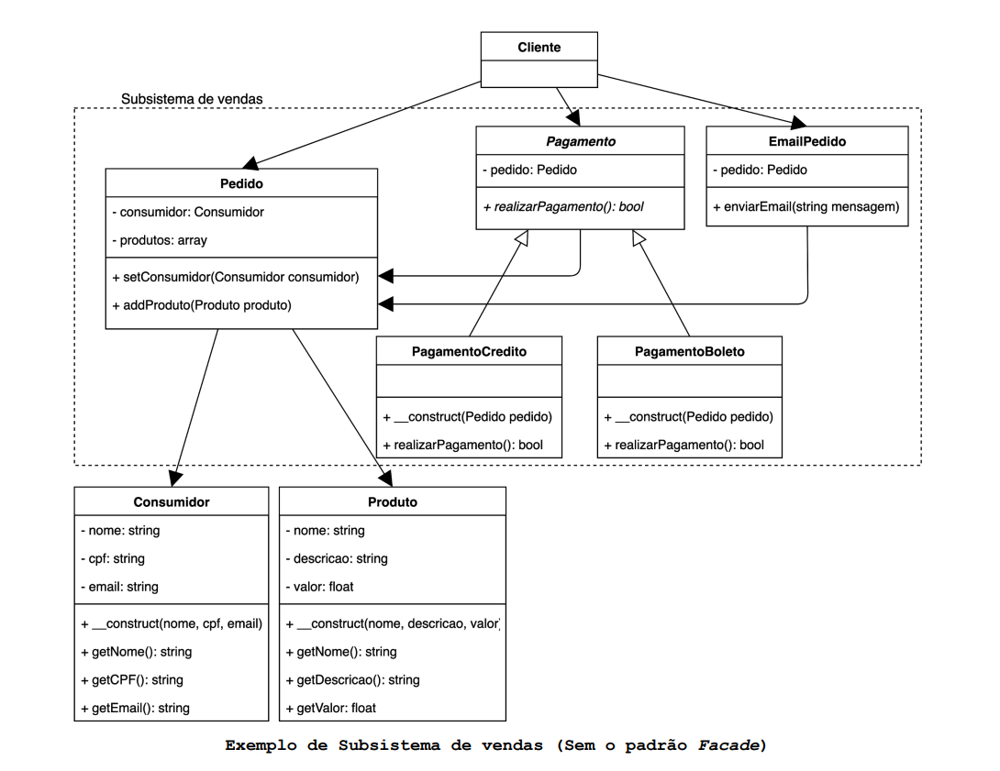
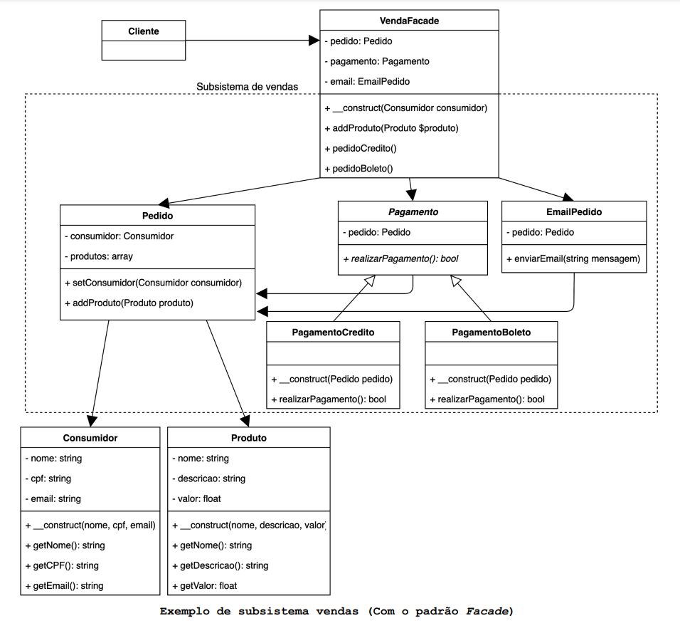
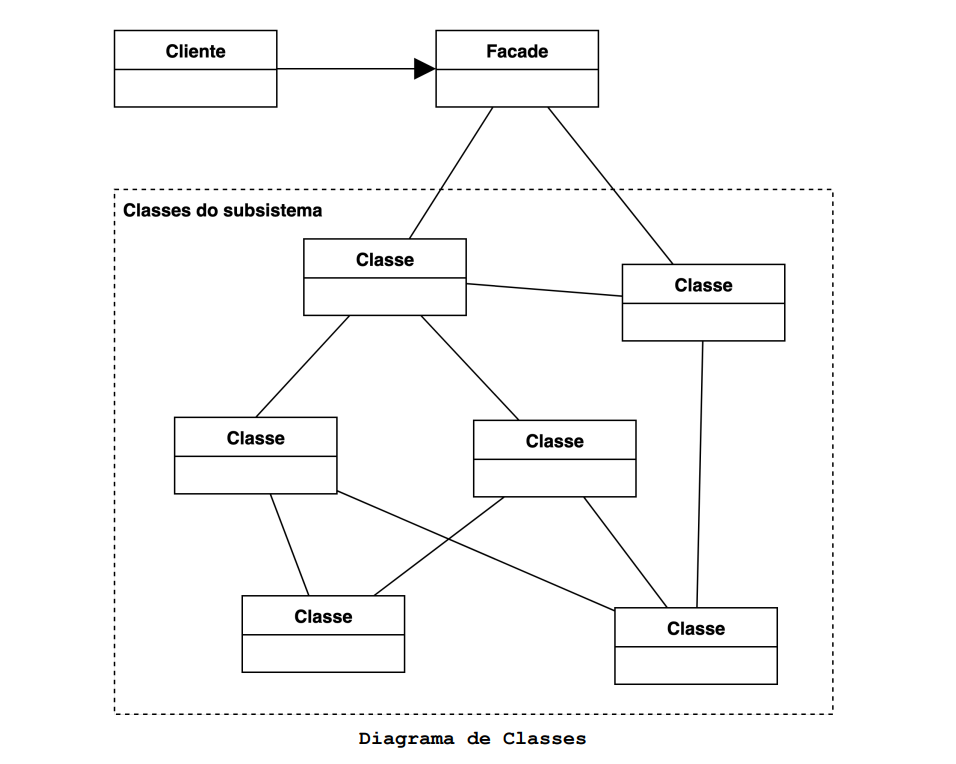

# O que é o padrão Facade?

O padrão Facade fornece uma interface unificada para um conjunto de interfaces em um subsistema. O Facade define uma interface 
de nível mais alto que facilita a utilização do subsistema.

## Motivação (Por que utilizar?)

A divisão de um sistema complexo em partes menores, ou seja, subsistemas, ajuda a reduzir a complexidade facilitando seu 
entendimento e manutenção. É importante que a comunicação e dependências entre tais subsistemas seja mínima para que sua 
complexidade não volte a crescer. Isso pode ser alcançado por meio da introdução de um objeto de fachada, que por sua vez 
fornece uma interface única e simplificada para o uso de um determinado subsistema.

A imagem abaixo ilustra um exemplo de sistema de vendas.

No subsistema proposto uma venda passa pelos seguintes estágios:

- O Cliente cria um Pedido que é composto por um Consumidor e um ou mais Produtos.
- Depois o Cliente solicita o pagamento com cartão de crédito ou Boleto por meio das classes PagamentoCredito ou PagamentoBoleto.
- Por fim, envia, por meio da classe EmailPedido, um email para o Consumidor com os dados do Pedido.

Repare na grande quantidade de classes que o cliente deste subsistema precisa conhecer. Isso cria um forte acoplamento no 
cliente. Se algo mudar no subsistema o cliente também terá que mudar, imagine que vários clientesdistintos utilizem o 
subsistema de vendas, todos eles teriam que mudar também.

O padrão Facade tem o objetivo de remover o forte acoplamento esimplificar o processo de vendas para o cliente. Isso é 
alcançado por meio de uma interface simplificada. Com a criação da classe VendaFacade o diagrama passa a ficar como o abaixo.

Agora o **Cliente** não depende mais diretamente do subsistema. A classe **VendaFacade** simplifica o processo para o 
**Cliente**. Agora, caso o subsistema mude basta editar a classe **VendaFacade**, isso evita a refatoração dos clientes 
do subsistema.

Embora o padrão Facade simplifique a interface, o **Cliente** ainda é capaz de acessar o subsistema de forma direta, o Facade 
tem como objetivo simplificar a interface sem encapsular as classes do subsistema, embora isso também seja possível.

Agora não existe mais às instânciações de **Pedido**, **PagamentoBoleto** (**PagamentoCredito** ou **PagamentoBoleto**) 
e **EmailPedido**. Agora isso passa a ser responsabilidade de **VendaFacade** que é a classe responsável por simplificar 
a utilização do subsistema de vendas para **Cliente**.

## Aplicabilidade (Quando utilizar?)

- Quando é necessário fornecer uma interface simples para um subsistema complexo. Os subsistemas geralmente ficam mais 
complexos à medida que evoluem. A maioria dos padrões, quando aplicados, resulta em classes cada vez menores. Isso torna 
o subsistema mais reutilizável e fácil de personalizar, mas também se torna mais difícil de usar para clientes que não 
precisam personalizá-lo. Uma fachada pode fornecer uma visualização padrão simples do subsistema que é boa o suficiente
para a maioria dos clientes. Somente clientes que precisam de mais personalizações precisam olhar além da fachada.

- Quando existem muitas dependências entre clientes e as classes de implementação de uma abstração. Introduzir uma fachada 
para desacoplar o subsistema dos clientes e de outros subsistemas, promove a independência e a portabilidade do subsistema.

- Quando se deseja estruturar subsistemas em camadas. Uma fachada define um ponto de entrada para cada nível do subsistema. 
Se os subsistemas são dependentes, será possível simplificar as dependências entre eles, fazendo-os se comunicar apenas 
através de suas fachadas.

- Quando se deseja estruturar subsistemas em camadas. Uma fachada define um ponto de entrada para cada nível do subsistema. 
Se os subsistemas são dependentes, será possível simplificar as dependências entre eles, fazendo-os se comunicar apenas 
através de suas fachadas.

## Componentes

- Cliente: É a classe que utiliza as facilidades oferecidas pela classe Facade.
- Facade: Classe que fornece uma interface unificada e mais simples para o cliente. Ela Sabe quais classes de subsistema 
são responsáveis por uma solicitação feita pelo Cliente, delega tais solicitações aos objetos apropriados do subsistema.

- Subsistema mais complexo: Possui as implementações das funcionalidades do subsistema. É o responsável por responder às
solicitações feitas pela classe Facade. Não sabe que Facade existe.

## Consequências

- O padrão Facade cria uma camada entre clientes e componentes do subsistema, isso reduz o número de objetos com os quais 
os clientes lidam e facilita o uso do subsistema.

- Promove fraco acoplamento entre o subsistema e seus clientes. Geralmente, os componentes em um subsistema são fortemente 
acoplados. O acoplamento fraco permite variar os componentes do subsistema sem afetar seus clientes. o padrão Facade ajuda 
eliminar dependências complexas ou circulares entre clientes e o subsistema. Isso pode ser uma consequência importante 
quando eles são implementados independentemente.

- O Facade não impede que os clientes usem as classes do subsistema se necessário. Assim, é possível escolher entre a 
facilidade de uso proporcionada pelo padrão Facade ou o controle total disponível diretamente no subsistema.
