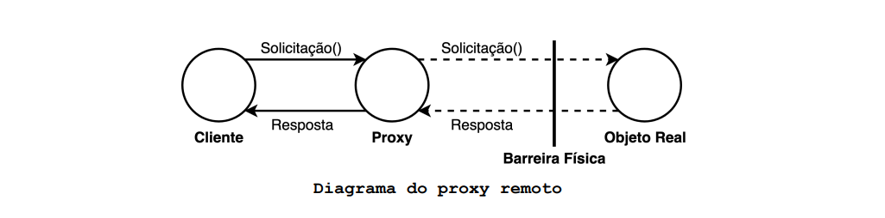
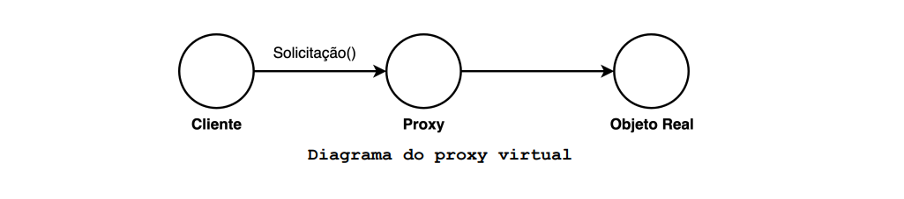
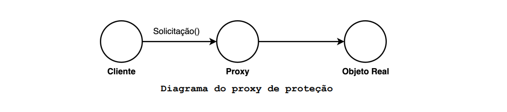
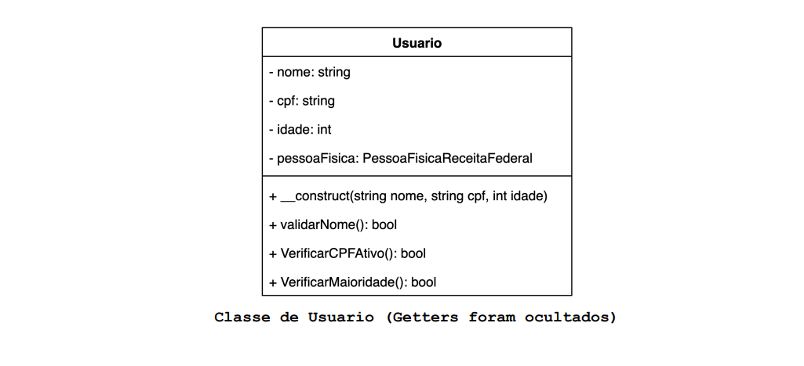
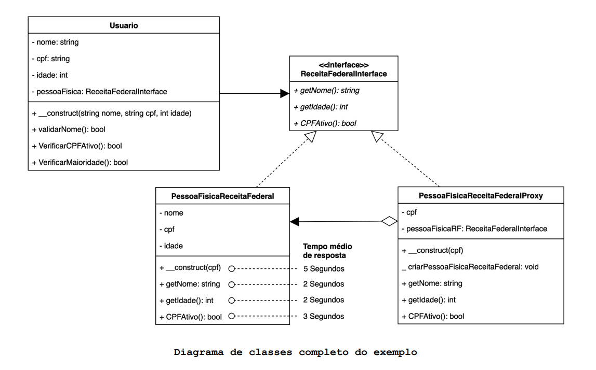
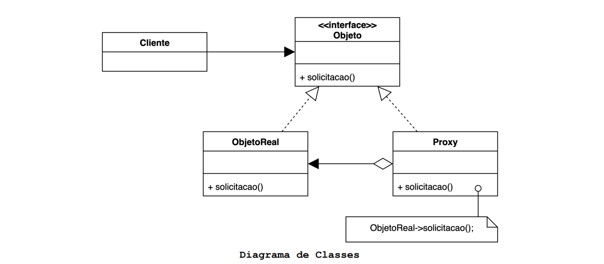

# O que é o padrão Proxy?

O padrão proxy fornece um substituto ou representante de outro objeto para gerenciar o acesso a ele.

## Motivação (Por que utilizar?)

O padrão Proxy deve ser utilizado para criar um objeto representante que controla o acesso a outro objeto, por sua vez
pode ser um objeto remoto, um recurso custoso ou algo que exija algum nível de segurança.

Existem vários tipos de proxy, suas aplicações variam conforme a finalidade exigida pelo contexto em que se encontra.
Algumas das maneiras com que os proxies controlam o acesso aos objetos são:

- **Proxy remoto**: controla o acesso a um objeto remoto.

Neste modelo de proxy o Cliente acredita que está se comunicando diretamente com o Objeto Real mas está se comunicando
com um representante local (proxy) do objeto remoto, isso é possível devido ao fato de que Proxy e o Objeto Real
implementam a mesma interface, ou seja, possuem o mesmo supertipo.

O Proxy finge ser o objeto remoto. Ele recebe a solicitação do Cliente a delega, via rede, ao Objeto Real.

O Objeto Real é quem realiza o trabalho, é nele onde estão implementados os métodos responsáveis por atender às
solicitações do Cliente.

O Proxy remoto é muito utilizado em sistemas distribuídos, onde
existe comunicação entre objetos que não estão no mesmo espaço de
endereçamento, ou até mesmo distantes fisicamente (em computadores
diferentes).

- **Proxy virtual**: controla o acesso a um objeto cuja criação é custosa.

Assim como no proxy remoto, neste modelo o Cliente também acredita estar se comunicando diretamente com o Objeto Real,
porém o papel do proxy é outro.

O objeto Proxy geralmente retarda a criação do Objeto Real até queele seja realmente necessário. Ele lida com as
solicitações do Cliente, cria o Objeto Real quando necessário e delega as tais solicitações a ele. A classe Proxy cria e
mantém referência a uma instância do Objeto Real.

Quando o Cliente envia uma solicitação ao Proxy, o objeto real pode ainda nem existir. Desta forma adotamos a política
inicialização preguiçosa (lazy initialization), onde o Objeto Real será criado somente se for realmente necessário.

- **Proxy de proteção**: controla o acesso a um recurso com base em direitos de acesso.

O proxy de proteção é muito semelhante ao proxy virtual, diferindo apenas em sua finalidade. Enquanto o proxy virtual
foca na otimização do gerenciamento de recursos custoso, o proxy de proteção foca no controle de acesso ao Objeto Real.
A classe Proxy é responsável por verificar se o cliente pode ou não acessar e/ou editar determinados recursos do objeto
real.

Considere que estamos trabalhando em um projeto que possui a seguinte classe:

Suponhamos que a classe acima consome uma API da receita federal para consultar os dados de uma pessoa física a partir
de seu CPF. Repare que o tempo de instanciação da classe é alto, em torno de 5 segundos, pois no construtor é feita a
conexão e autenticação na API. Os métodos desta classe também possuem tempos de resposta consideravelmente altos para os
padrões atuais.

A classe **PessoaFisicaReceitaFederal** é necessária no projeto para:

- Recuperar o nome real do dono do CPF;
- Recuperar a idade real do dono do CPF;
- Verificar se um CPF se encontra ativo na receita federal.

Para validar as informações esses dados serão comparados com os dados informados pelo usuário no momento do cadastro.

O problema é que o supervisor do projeto nos disse que os clientes estão reclamando devido a demora em todas as
funcionalidades relacionadas a um usuário. Sabemos que a origem do problema é a classe **PessoaFisicaReceitaFederal**,
porém, não é possível otimizar esta classe, já que a demora se dá pelo tempo de resposta da API.

A classe **Usuario** utiliza a classe **PessoaFisicaReceitaFederal** e por este motivo também é afetada pelo seu longo
tempo de resposta.

Os métodos da classe **PessoaFisicaReceitaFederal** também possuem tempos de resposta consideravelmente altos. É
possível fazer cache da primeira resposta destes métodos na classe **PessoaFisicaReceitaFederalProxy**. Deste modo, a
classe **PessoaFisicaReceitaFederalProxy**, caso seja necessário, irá delegar o processamento de um método a classe *
*PessoaFisicaReceitaFederal** apenas na primeira vez que ele for chamado, e armazenará a resposta. Da segunda vez em
diante a classe **PessoaFisicaReceitaFederalProxy** já saberá o que responder sem ter que recorrer a classe
**PessoaFisicaReceitaFederal**.

## Aplicabilidade (Quando utilizar?)

O padrão Proxy é aplicável sempre que for necessária uma referência a um objeto que seja mais versátil e sofisticada do
que um simples ponteiro. Essas são algumas situações comuns onde o padrão Proxy é aplicável:

1. Quando se precisa de um representante local para um objeto em um espaço de endereço diferente um **proxy remoto**
   pode ser aplicado.
2. Quando se deseja criar objetos custosos apenas sob demanda pode se utilizar um **proxy virtual**.
3. Quando objetos devem ter direitos de acesso diferentes, um **proxy de proteção** pode ser utilizado para controlar o
   acesso ao objeto original.
4. Uma **referência inteligente** (smart reference) é uma substituição de um ponteiro simples que executa ações
   adicionais quando um objeto é acessado. Os usos típicos incluem:

- Contagem do número de referências ao objeto real para que ele possa ser liberado automaticamente da memória quando não
  houver mais referências a ele.
- Carregamento persistente de um objeto na memória quando é mencionado pela primeira vez.
- Verificação de bloqueio no Objeto Real antes de ser acessado para garantir que nenhum outro objeto possa alterá-lo de
  forma indevida.

## Componentes

- **Cliente**: Objeto que consome a Proxy.
- **Objeto**: Define a interface que é implementada tanto pelo ObjetoReal quanto pelo Proxy, permitindo que o Cliente
  trate o Proxy como sendo o ObjetoReal.
- **ObjetoReal**: É o objeto que executa as solicitações feitas pelo Cliente. Nele estão as implementações capazes de
  responder tais solicitações.
- **Proxy**: Mantém uma referência ao ObjetoReal para poder encaminhar solicitações a ele sempre que necessário. Prove
  para o Cliente a mesma interface do ObjetoReal para que possa ser utilizada pelo Cliente de forma transparente. Além
  de controlar o acesso ao ObjetoReal também pode ser responsável por criá-lo e excluí-lo.

Algumas outras responsabilidades variam de acordo com o tipo de proxy.

- Os **proxies remotos** são responsáveis por codificar uma solicitação e seus argumentos e por enviar tal solicitação
  codificada para o ObjetoReal em um espaço de endereço diferente.
- Já os **proxies virtuais** podem fazer cache de informações adicionais sobre o ObjetoReal, para seja possível adiar o
  acesso direto a ele.
- Por fim, os **proxies de proteção** verificam se o Cliente possui as permissões de acesso necessárias para executar
  uma solicitação.

## Consequências

- Um proxy remoto pode ocultar o fato de um objeto estar alocado em um espaço de endereçamento diferente.
- Um proxy virtual pode executar otimizações, como criar um objeto sob demanda.
- Os proxies de proteção e as referências inteligentes permitem tarefas adicionais de manutenção quando um objeto é
  acessado.
- Princípio Aberto/Fechado é respeitado. É possível introduzir novos proxies sem alterar o serviço ou os clientes.
- O código pode se tornar mais complicado, pois diversas novas classes podem ser introduzidas no código.
- A latência (tempo de resposta) dos serviços pode aumentar.